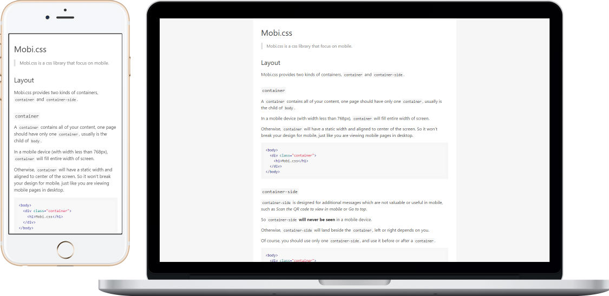

## Table of Content

- [Introduction](#introduction)
- [Downloads](#downloads)
- [Documentation](#documentation)
  - [Layout](#layout)
  - [Grid System](#grid-system)
  - [Typography](#typography)
  - [Tables](#tables)
  - [Forms](#forms)
  - [Utilities](#utilities)
- [Customize](#customize)
- [Indexes](#indexes)

## Introduction

- Only 2.8kb after gzipped, less than Skeleton, Pure.css and Bootstrap v4, etc.
- Heavy use of flexbox, super flexible, less than 10 lines of custom style in the [Homepage](http://getmobicss.com/).
- Focus on mobile, show mobile pages in desktop with a sidebar on the left or right.

## Downloads

You can download Mobi.css in [this page](https://github.com/xcatliu/mobi.css/releases).

Or use npm to install:

```shell
npm install --save mobi.css
```

You can also build Mobi.css to your project if you are using sass.

```scss
@import 'mobi.css/src/mobi';
```

Be sure you have added `node-modules` to your sass's [load_paths](http://stackoverflow.com/questions/6502313/sass-import-a-file-from-a-different-directory).

## Documentation

### Layout

Mobi.css provides two kinds of containers, `container` and `container-side`, as well as a simple but flexible grid system.

#### `container`

A `container` contains all of your contents, one page should have only one `container`. In most cases, `container` is the child of `<body>`.

On a mobile device (with width less than 768px), `container` will fill entire width of screen.

Otherwise, `container` will have a fixed width and aligned to the center of the screen. So it won't break your design for mobile. Looks like you are viewing mobile pages on desktop.



```html
<body>
  <div class="container">
    <h1>Mobi.css</h1>
  </div>
</body>
```

#### `container-side`

`container-side` is designed for additional messages which are not valuable or useful for mobile, such as *Scan to view on mobile* or *Go to top*.

So `container-side` **will never be seen** on a mobile device.

Otherwise, `container-side` will land beside the `container`, left or right depends on you.

Of course, you should use only one `container-side`, and use it before or after a `container`.


```html
<body>
  <div class="container">
    <h1>Mobi.css</h1>
  </div>
  <div class="container-side">
    <p>Scan to view on mobile</p>
    
  </div>
</body>
```

#### Grid System

Mobile doesn't need such a complicate 12# grid system, Mobi.css provides a simpler but flexible grid system.

First of all, you can create a `row` which contain several `col`s, in this case, `row`'s width is divided equally between `col`s.

<div class="row mt-15">
  <div class="col alert-success">Lightweight</div>
  <div class="col alert-success">Flexible</div>
  <div class="col alert-success">Focus on Mobile</div>
</div>
<div class="row">
  <div class="col alert-success">青龙</div>
  <div class="col alert-success">白虎</div>
  <div class="col alert-success">朱雀</div>
  <div class="col alert-success">玄武</div>
</div>

```html
<div class="row mt-15">
  <div class="col alert-success">Lightweight</div>
  <div class="col alert-success">Flexible</div>
  <div class="col alert-success">Focus on Mobile</div>
</div>
<div class="row">
  <div class="col alert-success">青龙</div>
  <div class="col alert-success">白虎</div>
  <div class="col alert-success">朱雀</div>
  <div class="col alert-success">玄武</div>
</div>
```

Secondly, you can use `col-1-2`, `col-1-3` and `col-1-4` to achieve a maximum 4# grid.

<div class="row mt-15">
  <div class="col-1-2 alert-success">.col-1-2</div>
  <div class="col alert-success">.col</div>
</div>
<div class="row">
  <div class="col-1-3 alert-success">.col-1-3</div>
  <div class="col alert-success">.col</div>
</div>
<div class="row">
  <div class="col-1-4 alert-success">.col-1-4</div>
  <div class="col alert-success">.col</div>
</div>
<div class="row">
  <div class="col alert-success">.col</div>
  <div class="col-1-3 alert-success">.col-1-3</div>
</div>
<div class="row">
  <div class="col-1-4 alert-success">.col-1-4</div>
  <div class="col-1-2 alert-success">.col-1-2</div>
  <div class="col-1-4 alert-success">.col-1-4</div>
</div>

```html
<div class="row mt-15">
  <div class="col-1-2 alert-success">.col-1-2</div>
  <div class="col alert-success">.col</div>
</div>
<div class="row">
  <div class="col-1-3 alert-success">.col-1-3</div>
  <div class="col alert-success">.col</div>
</div>
<div class="row">
  <div class="col-1-4 alert-success">.col-1-4</div>
  <div class="col alert-success">.col</div>
</div>
<div class="row">
  <div class="col alert-success">.col</div>
  <div class="col-1-3 alert-success">.col-1-3</div>
</div>
<div class="row">
  <div class="col-1-4 alert-success">.col-1-4</div>
  <div class="col-1-2 alert-success">.col-1-2</div>
  <div class="col-1-4 alert-success">.col-1-4</div>
</div>
```

#### Use Flexbox for Layout

You probably know Mobi.css can use flexbox for layout, and so should you! [Now it's safe to use flexbox on all mobile browsers](http://caniuse.com/#feat=flexbox).

Here is an example for how you can use `col` to achieve a typical fixed-fluid layout.

<div class="row mt-15">
  <div class="col" style="max-width:70px;"><i class="fa fa-github" style="font-size:56px;"></i></div>
  <div class="col alert-success" style="margin-right:30px;">Hi, xcatliu, do you know what is Mobi.css?</div>
</div>
<div class="row mt-15">
  <div class="col alert-success text-right" style="margin-left:30px;">Sure I know, Mobi.css is a lightweight, flexible css framework that focus on mobile.</div>
  <div class="col" style="max-width:70px;"></div>
</div>

```html
<div class="row mt-15">
  <div class="col" style="max-width:70px;"><i class="fa fa-github" style="font-size:56px;"></i></div>
  <div class="col alert-success" style="margin-right:30px;">Hi, xcatliu, do you know what is Mobi.css?</div>
</div>
<div class="row mt-15">
  <div class="col alert-success text-right" style="margin-left:30px;">Sure I know, Mobi.css is a lightweight, flexible css framework that focus on mobile.</div>
  <div class="col" style="max-width:70px;"></div>
</div>
```

#### Margin Top Only

Nearly all margins in Mobi.css have a `0` value for `margin-bottom`. Instead, Mobi.css use `margin-top` to make contents flow clearly.

That do make sense, since it's each section's responsibility to determine the length it should margin to top.

For example, `<h1>` ~ `<h6>` have a length of `30px` margin to top, in the meantime, `<p>`, `<ul>`, `<table>` have a length of `15px` margin to top.

Mobi.css also provides three classes for easily manually override the length to margin to top, they are `mt-30`, `mt-15` and `mt-0`, the length of `margin-top` are `30px`, `15px` and `0`.

<section class="mt-15 alert-success">section.mt-15</section>
<p class="mt-0 alert-success">p.mt-0</p>
<section class="mt-30 alert-success">section.mt-30</section>

```html
<section class="mt-15 alert-success">section.mt-15</section>
<p class="mt-0 alert-success">p.mt-0</p>
<section class="mt-30 alert-success">section.mt-30</section>
```

### Typography

Mobi.css is designed for content based website. It has a pure but pleasant experience for reading.

Most of styles for typography are reset and do not need any classes more.

This site itself is a real example. You guys are smart, so for this part it's not necessary to write examples anymore.

### Tables

Although tables is not widely used in mobile, sometimes you may need it.

However, tables always renders out of screen, especially in small mobiles. So you should probably need a `scroll-view` area to place your table.

And don't forget to add `class="table"` to your `<table>` element.

Why don't Mobi.css reset `<table>` element so you don't need to add the `table` class?

Because once `<table>` element is reset, it's hard to set it back. It's more friendly to third party libraries if we don't reset `<table>` element. The same reason for `<form>`.

<div class="scroll-view">
  <table class="table">
    <thead>
      <tr><th>Name</th><th>Author</th><th>Language</th><th>Size</th><th>Features</th><th>GitHub</th></tr>
    </thead>
    <tbody>
      <tr>
        <td><a href="http://getmobicss.com/">Mobi.css</a></td>
        <td><a href="https://github.com/xcatliu">xcatliu</a></td>
        <td>Sass</td>
        <td>2.8kb</td>
        <td><i class="fa fa-star"></i><i class="fa fa-star"></i><i class="fa fa-star"></i></td>
        <td><a href="https://github.com/xcatliu/mobi.css">Mobi.css GitHub</a></td>
      </tr>
      <tr>
        <td><a href="http://getskeleton.com/">Skeleton</a></td>
        <td><a href="https://github.com/dhg">Dave Gamache</a></td>
        <td>Css</td>
        <td>3.2kb</td>
        <td><i class="fa fa-star"></i></td>
        <td><a href="https://github.com/dhg/Skeleton/">Skeleton GitHub</a></td>
      </tr>
      <tr>
        <td><a href="http://purecss.io/">Pure.css</a></td>
        <td><a href="https://github.com/yahoo">Yahoo Inc.</a></td>
        <td>Css</td>
        <td>4.6kb</td>
        <td><i class="fa fa-star"></i><i class="fa fa-star"></i></td>
        <td><a href="https://github.com/yahoo/pure/">Pure.css GitHub</a></td>
      </tr>
      <tr>
        <td><a href="http://v4-alpha.getbootstrap.com/">Bootstrap v4</a></td>
        <td><a href="https://github.com/twbs">Twitter</a></td>
        <td>Sass, JavaScript</td>
        <td>20.1kb</td>
        <td><i class="fa fa-star"></i><i class="fa fa-star"></i><i class="fa fa-star"></i><i class="fa fa-star"></i><i class="fa fa-star"></i></td>
        <td><a href="https://github.com/twbs/bootstrap/tree/v4-dev">Bootstrap v4 GitHub</a></td>
      </tr>
      <tr>
        <td><a href="http://goratchet.com/"><s>Ratchet</s></a></td>
        <td colspan="5"><a href="https://github.com/twbs/ratchet/issues/792"><s>This project is dying.</s></a></td>
      </tr>
    </tbody>
  </table>
</div>

```html
<div class="scroll-view">
  <table class="table">
    <thead>
      <tr><th>Name</th><th>Author</th><th>Language</th><th>Size</th><th>Features</th><th>GitHub</th></tr>
    </thead>
    <tbody>
      <tr>
        <td><a href="http://getmobicss.com/">Mobi.css</a></td>
        <td><a href="https://github.com/xcatliu">xcatliu</a></td>
        <td>Sass</td>
        <td>2.8kb</td>
        <td><i class="fa fa-star"></i><i class="fa fa-star"></i><i class="fa fa-star"></i></td>
        <td><a href="https://github.com/xcatliu/mobi.css">Mobi.css GitHub</a></td>
      </tr>
      <tr>
        <td><a href="http://getskeleton.com/">Skeleton</a></td>
        <td><a href="https://github.com/dhg">Dave Gamache</a></td>
        <td>Css</td>
        <td>3.2kb</td>
        <td><i class="fa fa-star"></i></td>
        <td><a href="https://github.com/dhg/Skeleton/">Skeleton GitHub</a></td>
      </tr>
      <tr>
        <td><a href="http://purecss.io/">Pure.css</a></td>
        <td><a href="https://github.com/yahoo">Yahoo Inc.</a></td>
        <td>Css</td>
        <td>4.6kb</td>
        <td><i class="fa fa-star"></i><i class="fa fa-star"></i></td>
        <td><a href="https://github.com/yahoo/pure/">Pure.css GitHub</a></td>
      </tr>
      <tr>
        <td><a href="http://v4-alpha.getbootstrap.com/">Bootstrap v4</a></td>
        <td><a href="https://github.com/twbs">Twitter</a></td>
        <td>Sass, JavaScript</td>
        <td>20.1kb</td>
        <td><i class="fa fa-star"></i><i class="fa fa-star"></i><i class="fa fa-star"></i><i class="fa fa-star"></i><i class="fa fa-star"></i></td>
        <td><a href="https://github.com/twbs/bootstrap/tree/v4-dev">Bootstrap v4 GitHub</a></td>
      </tr>
      <tr>
        <td><a href="http://goratchet.com/"><s>Ratchet</s></a></td>
        <td colspan="5"><a href="https://github.com/twbs/ratchet/issues/792"><s>This project is dying.</s></a></td>
      </tr>
    </tbody>
  </table>
</div>
```

### Forms

Mobi.css believes that on mobile devices, **each row should have only one input**.

You need add `class="form"` to a `<form>` element.

#### Basic Forms

<form class="form" action="#basic-forms">
  <input type="text" placeholder="Name"/>
  <input type="password" placeholder="Password"/>
  <label><input type="checkbox"/>I agree to terms.</label>
  <input type="submit" value="Sign Up Now"/>
</form>

```html
<form class="form" action="#basic-forms">
  <input type="text" placeholder="Name"/>
  <input type="email" placeholder="Email"/>
  <label><input type="checkbox"/>I agree to terms.</label>
  <input type="submit" value="Sign Up Now"/>
</form>
```

#### Complicate Forms

If you want to have multiple inputs in one row, you should use grid system.

<form class="form" action="#complicate-forms">
  <div class="row">
    <label class="col label text-right" class="col label text-right" for="multiple-inputs-name" style="max-width:90px;">Name: </label>
    <div class="col"><input type="text" id="multiple-inputs-name" placeholder="xcatliu"/></div>
  </div>
  <div class="row">
    <label class="col label text-right" style="max-width:90px;">Gender: </label>
    <div class="col"><label>
      <input type="radio" name="multiple-inputs-gender" value="Male"/>Male
    </label></div>
    <div class="col"><label>
      <input type="radio" name="multiple-inputs-gender" value="Female"/>Female
    </label></div>
  </div>
  <div class="row">
    <label class="col label text-right" style="max-width:90px;">Country: </label>
    <div class="col">
      <select>
        <option disabled selected value> -- select -- </option>
        <option>China</option>
        <option>USA</option>
      </select>
    </div>
  </div>
  <div class="row">
    <label class="col label text-right" style="max-width:90px;">Avatar:</label>
    <div class="col">
      <input type="file"/>
    </div>
  </div>
  <div class="row">
    <label class="col label text-right" for="multiple-inputs-bio" style="max-width:90px;">Bio: </label>
    <div class="col">
      <textarea id="multiple-inputs-bio" placeholder="Who are you?"></textarea>
    </div>
  </div>
  <div class="row">
    <div style="width:90px;"></div>
    <div class="col">
      <button type="reset" class="btn-danger">Reset</button>
    </div>
    <div class="col">
      <button type="submit" class="btn-primary">Submit</button>
    </div>
  </div>
</form>

```html
<form class="form" action="#complicate-forms">
  <div class="row">
    <label class="col label text-right" class="col label text-right" for="multiple-inputs-name" style="max-width:90px;">Name: </label>
    <div class="col"><input type="text" id="multiple-inputs-name" placeholder="xcatliu"/></div>
  </div>
  <div class="row">
    <label class="col label text-right" style="max-width:90px;">Gender: </label>
    <div class="col"><label>
      <input type="radio" name="multiple-inputs-gender" value="Male"/>Male
    </label></div>
    <div class="col"><label>
      <input type="radio" name="multiple-inputs-gender" value="Female"/>Female
    </label></div>
  </div>
  <div class="row">
    <label class="col label text-right" style="max-width:90px;">Country: </label>
    <div class="col">
      <select>
        <option disabled selected value> -- select -- </option>
        <option>China</option>
        <option>USA</option>
      </select>
    </div>
  </div>
  <div class="row">
    <label class="col label text-right" style="max-width:90px;">Avatar:</label>
    <div class="col">
      <input type="file"/>
    </div>
  </div>
  <div class="row">
    <label class="col label text-right" for="multiple-inputs-bio" style="max-width:90px;">Bio: </label>
    <div class="col">
      <textarea id="multiple-inputs-bio" placeholder="Who are you?"></textarea>
    </div>
  </div>
  <div class="row">
    <label class="col label text-right" style="max-width:90px;"></label>
    <div class="col" style="max-width:90px;">
      <button type="reset" class="btn-danger">Reset</button>
    </div>
    <div class="col"></div>
    <div class="col" style="max-width:100px;">
      <button type="submit" class="btn-primary">Submit</button>
    </div>
  </div>
</form>
```

A warn tip, when you are using `<label>` element, you can add `class="label"` if it's a text label, but don't add the class if it's the parent of `checkbox` or `radio`.

#### `disabled` and `readonly`

<form class="form" action="#disabled-forms">
  <input type="text" placeholder="Disabled Input" disabled/>
  <input type="text" value="Readonly Input Value" readonly/>
  <div class="row">
  <div class="col"><input type="button" value="Set" disabled/></div>
  <div class="col"><button type="button" class="btn-primary" disabled>Button</button></div>
  <div class="col"><input type="button" class="btn-danger" value="Disabled" disabled/></div>
  </div>
</form>

```html
<form class="form" action="#disabled-forms">
  <input type="text" placeholder="Disabled Input" disabled/>
  <input type="text" value="Readonly Input Value" readonly/>
  <div class="row">
    <div class="col"><input type="button" value="Set" disabled/></div>
    <div class="col"><button type="button" class="btn-primary" disabled>Button</button></div>
    <div class="col"><input type="button" class="btn btn-danger" value="Disabled" disabled/></div>
  </div>
</form>
```

#### `btn`

You can also use `btn` to make an `<a>` to a button.

<a href="javascript:void(0);" class="btn">a.btn</a>
<a href="javascript:void(0);" class="btn btn-primary">a.btn.btn-primary</a>
<a href="javascript:void(0);" class="btn btn-danger">a.btn.btn-danger</a>

```html
<a href="javascript:void(0);" class="btn">a.btn</a>
<a href="javascript:void(0);" class="btn btn-primary">a.btn.btn-primary</a>
<a href="javascript:void(0);" class="btn btn-danger">a.btn.btn-danger</a>
```

One more thing, `<button>` inside `<form>` don't need a class `btn`. But when you create a `<button>` outside `<form>`, you should always add `btn` class.

<button class="mt-15">A Button Without `btn`</button>
<button class="btn">A Button With `btn`</button>

```html
<button class="mt-15">A Button Without `btn`</button>
<button class="btn">A Button With `btn`</button>
```

That is because Mobi.css don't want to reset the default styles of `button`, this make third party libraries easy to override the styles of `button`.

### Utilities

Mobi.css also provides some useful utilities, like layout `mt-30`, `text-left`, `scroll-view`, etc.

#### Layout Utilities

As mentioned in [Margin Top Only](#margin-top-only) section, Mobi.css provides three classes for override the length to margin to top, they are `mt-30`, `mt-15` and `mt-0`.

For more details, please read [Margin Top Only](#margin-top-only) section.

#### Align Utilities

You can use Mobi.css to easily align contents.

##### Align Inline Contents

<div class="text-left alert-success mt-15">Mobi.css is awesome!</div>
<div class="text-center alert-success">Awesome!</div>
<div class="text-right alert-success">Some!</div>

```html
<div class="text-left alert-success mt-15">Mobi.css is awesome!</div>
<div class="text-center alert-success">Awesome!</div>
<div class="text-right alert-success">Some!</div>
```

#### `scroll-view`

Mobile devices usually have small width, so it's very useful to use a `scroll-view` class.

Mobi.css optimize `scroll-view` to make it smoothly to scroll.

##### Scroll Horizontal

<div class="mt-15 scroll-view">
  <div style="width:1024px;">
    <i class="fa fa-adjust" style="font-size:6rem;"></i>
    <i class="fa fa-anchor" style="font-size:6rem;"></i>
    <i class="fa fa-archive" style="font-size:6rem;"></i>
    <i class="fa fa-area-chart" style="font-size:6rem;"></i>
    <i class="fa fa-arrows" style="font-size:6rem;"></i>
    <i class="fa fa-asterisk" style="font-size:6rem;"></i>
    <i class="fa fa-at" style="font-size:6rem;"></i>
    <i class="fa fa-automobile" style="font-size:6rem;"></i>
    <i class="fa fa-ban" style="font-size:6rem;"></i>
    <i class="fa fa-bank" style="font-size:6rem;"></i>
    <i class="fa fa-bar-chart" style="font-size:6rem;"></i>
    <i class="fa fa-battery-0" style="font-size:6rem;"></i>
    <i class="fa fa-beer" style="font-size:6rem;"></i>
    <i class="fa fa-bell" style="font-size:6rem;"></i>
    <i class="fa fa-bicycle" style="font-size:6rem;"></i>
  </div>
</div>

```html
<div class="mt-15 scroll-view">
  <div style="width:1024px;">
    <i class="fa fa-adjust" style="font-size:6rem;"></i>
    <i class="fa fa-anchor" style="font-size:6rem;"></i>
    <i class="fa fa-archive" style="font-size:6rem;"></i>
    <i class="fa fa-area-chart" style="font-size:6rem;"></i>
    <i class="fa fa-arrows" style="font-size:6rem;"></i>
    <i class="fa fa-asterisk" style="font-size:6rem;"></i>
    <i class="fa fa-at" style="font-size:6rem;"></i>
    <i class="fa fa-automobile" style="font-size:6rem;"></i>
    <i class="fa fa-ban" style="font-size:6rem;"></i>
    <i class="fa fa-bank" style="font-size:6rem;"></i>
    <i class="fa fa-bar-chart" style="font-size:6rem;"></i>
    <i class="fa fa-battery-0" style="font-size:6rem;"></i>
    <i class="fa fa-beer" style="font-size:6rem;"></i>
    <i class="fa fa-bell" style="font-size:6rem;"></i>
    <i class="fa fa-bicycle" style="font-size:6rem;"></i>
  </div>
</div>
```

##### Scroll Vertical

This is pretty easy, just set the `max-height` of `scroll-view`, if not set, the default `max-height` is `300px`.

<div class="mt-15 scroll-view" style="max-height:400px;">
  <h2>琵琶行</h2>
  <address>作者：白居易</address>
  <p>
    浔阳江头夜送客，枫叶荻花秋瑟瑟。
    <br/>主人下马客在船，举酒欲饮无管弦。
    <br/>醉不成欢惨将别，别时茫茫江浸月。
    <br/>忽闻水上琵琶声，主人忘归客不发。
    <br/>寻声暗问弹者谁？琵琶声停欲语迟。
    <br/>移船相近邀相见，添酒回灯重开宴。
    <br/>千呼万唤始出来，犹抱琵琶半遮面。
    <br/>转轴拨弦三两声，未成曲调先有情。
    <br/>弦弦掩抑声声思，似诉平生不得志。
    <br/>低眉信手续续弹，说尽心中无限事。
    <br/>轻拢慢捻抹复挑，初为霓裳后六幺。
    <br/>大弦嘈嘈如急雨，小弦切切如私语。
    <br/>嘈嘈切切错杂弹，大珠小珠落玉盘。
    <br/>间关莺语花底滑，幽咽泉流冰下难。
    <br/>冰泉冷涩弦凝绝，凝绝不通声暂歇。
    <br/>别有幽愁暗恨生，此时无声胜有声。
    <br/>银瓶乍破水浆迸，铁骑突出刀枪鸣。
    <br/>曲终收拨当心画，四弦一声如裂帛。
    <br/>东船西舫悄无言，唯见江心秋月白。
    <br/>沉吟放拨插弦中，整顿衣裳起敛容。
    <br/>自言本是京城女，家在虾蟆陵下住。
    <br/>十三学得琵琶成，名属教坊第一部。
    <br/>曲罢曾教善才服，妆成每被秋娘妒。
    <br/>五陵年少争缠头，一曲红绡不知数。
    <br/>钿头银篦击节碎，血色罗裙翻酒污。
    <br/>今年欢笑复明年，秋月春风等闲度。
    <br/>弟走从军阿姨死，暮去朝来颜色故。
    <br/>门前冷落鞍马稀，老大嫁作商人妇。
    <br/>商人重利轻别离，前月浮梁买茶去。
    <br/>去来江口守空船，绕船月明江水寒。
    <br/>夜深忽梦少年事，梦啼妆泪红阑干。
    <br/>我闻琵琶已叹息，又闻此语重唧唧。
    <br/>同是天涯沦落人，相逢何必曾相识！
    <br/>我从去年辞帝京，谪居卧病浔阳城。
    <br/>浔阳地僻无音乐，终岁不闻丝竹声。
    <br/>住近湓江地低湿，黄芦苦竹绕宅生。
    <br/>其间旦暮闻何物？杜鹃啼血猿哀鸣。
    <br/>春江花朝秋月夜，往往取酒还独倾。
    <br/>岂无山歌与村笛？呕哑嘲哳难为听。
    <br/>今夜闻君琵琶语，如听仙乐耳暂明。
    <br/>莫辞更坐弹一曲，为君翻作琵琶行。
    <br/>感我此言良久立，却坐促弦弦转急。
    <br/>凄凄不似向前声，满座重闻皆掩泣。
    <br/>座中泣下谁最多？江州司马青衫湿。
  </p>
</div>

```html
<div class="mt-15 scroll-view" style="max-height:400px;">
  <h2>琵琶行</h2>
  <address>作者：白居易</address>
  <p>
    浔阳江头夜送客，枫叶荻花秋瑟瑟。
    <br/>主人下马客在船，举酒欲饮无管弦。
    <br/>醉不成欢惨将别，别时茫茫江浸月。
    <br/>忽闻水上琵琶声，主人忘归客不发。
    <br/>寻声暗问弹者谁？琵琶声停欲语迟。
    <br/>移船相近邀相见，添酒回灯重开宴。
    <br/>千呼万唤始出来，犹抱琵琶半遮面。
    <br/>转轴拨弦三两声，未成曲调先有情。
    <br/>弦弦掩抑声声思，似诉平生不得志。
    <br/>低眉信手续续弹，说尽心中无限事。
    <br/>轻拢慢捻抹复挑，初为霓裳后六幺。
    <br/>大弦嘈嘈如急雨，小弦切切如私语。
    <br/>嘈嘈切切错杂弹，大珠小珠落玉盘。
    <br/>间关莺语花底滑，幽咽泉流冰下难。
    <br/>冰泉冷涩弦凝绝，凝绝不通声暂歇。
    <br/>别有幽愁暗恨生，此时无声胜有声。
    <br/>银瓶乍破水浆迸，铁骑突出刀枪鸣。
    <br/>曲终收拨当心画，四弦一声如裂帛。
    <br/>东船西舫悄无言，唯见江心秋月白。
    <br/>沉吟放拨插弦中，整顿衣裳起敛容。
    <br/>自言本是京城女，家在虾蟆陵下住。
    <br/>十三学得琵琶成，名属教坊第一部。
    <br/>曲罢曾教善才服，妆成每被秋娘妒。
    <br/>五陵年少争缠头，一曲红绡不知数。
    <br/>钿头银篦击节碎，血色罗裙翻酒污。
    <br/>今年欢笑复明年，秋月春风等闲度。
    <br/>弟走从军阿姨死，暮去朝来颜色故。
    <br/>门前冷落鞍马稀，老大嫁作商人妇。
    <br/>商人重利轻别离，前月浮梁买茶去。
    <br/>去来江口守空船，绕船月明江水寒。
    <br/>夜深忽梦少年事，梦啼妆泪红阑干。
    <br/>我闻琵琶已叹息，又闻此语重唧唧。
    <br/>同是天涯沦落人，相逢何必曾相识！
    <br/>我从去年辞帝京，谪居卧病浔阳城。
    <br/>浔阳地僻无音乐，终岁不闻丝竹声。
    <br/>住近湓江地低湿，黄芦苦竹绕宅生。
    <br/>其间旦暮闻何物？杜鹃啼血猿哀鸣。
    <br/>春江花朝秋月夜，往往取酒还独倾。
    <br/>岂无山歌与村笛？呕哑嘲哳难为听。
    <br/>今夜闻君琵琶语，如听仙乐耳暂明。
    <br/>莫辞更坐弹一曲，为君翻作琵琶行。
    <br/>感我此言良久立，却坐促弦弦转急。
    <br/>凄凄不似向前声，满座重闻皆掩泣。
    <br/>座中泣下谁最多？江州司马青衫湿。
  </p>
</div>
```

## Customize

For advanced users, it's pretty easy to customize Mobi.css.

Just copy variables from `src/_variables.scss` to `src/_custom.scss` to override default values, without modifying source files.

## Indexes

The indexes of all available classes.

- [`btn`](#-btn-)
- [`btn-danger`](#complicate-forms)
- [`btn-primary`](#complicate-forms)
- [`col`](#grid-system)
- [`col-1-2`](#grid-system)
- [`col-1-4`](#grid-system)
- [`col-1-3`](#grid-system)
- [`container`](#-container)
- [`container-side`](#-container-side)
- [`form`](#forms)
- [`label`](#complicate-forms)
- [`mt-0`](#margin-top-only)
- [`mt-15`](#margin-top-only)
- [`mt-30`](#margin-top-only)
- [`row`](#grid-system)
- [`scroll-view`](#-scroll-view-)
- [`table`](#tables)
- [`text-center`](#align-inline-contents)
- [`text-left`](#align-inline-contents)
- [`text-right`](#align-inline-contents)
